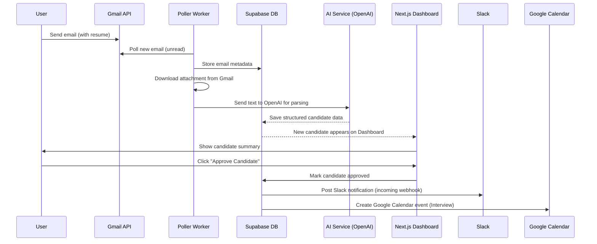

# Executive Summary

This **Foundation Specification** establishes the core infrastructure and functionality for the AI Recruiting Operations Platform. Its goal is to implement the baseline system that can autonomously ingest candidate emails, extract and store candidate data, and support human-approved actions. Key outcomes include setting up secure Gmail OAuth, a reliable email polling pipeline, resume parsing into structured candidate records, and the fundamental APIs and database needed for the UI and workflows. All foundation components must be in place so that sending a resume via email results in a new candidate profile appearing in the dashboard. This document defines the **scope**, **architecture**, **rules**, **requirements**, and **acceptance criteria** for the foundation milestone (01-Foundation) in preparation for iterative development. It is written as a complete engineering specification for the coding agent, and it includes a *Current State Audit* step that the agent must perform before making changes.

## Scope of this Milestone

**Included in Foundation (Core)**:

- **Authentication & User Setup**: Google OAuth 2.0 login via NextAuth, storing tokens (with offline access to obtain refresh tokens). Session management and basic user model.
- **Database & Models**: Configure Supabase (Postgres) with tables for Users, Emails, Resumes/Attachments, Candidates, Jobs, Approvals, and Audit logs. Define key schemas and relations (high-level below).
- **Gmail Integration**: Secure OAuth flow with `access_type=offline` to obtain a long-lived refresh token. Initial manual “Sync Now” endpoint to trigger polling. Background worker (cron or queue) to poll Gmail every N seconds and store new emails.
- **Attachment Pipeline**: Detect and download email attachments (PDF/Word resumes) via Gmail API. If PDF, use a PDF-to-text library; if image/other, fallback to OCR (Tesseract recommended) for text extraction.
- **AI Parsing**: Use OpenAI (GPT-4o) models to classify emails (skip vs candidate) and parse resume text into a structured candidate data object (name, contact, skills, experience). Use JSON Schema output (strict mode) to guarantee valid JSON.
- **Candidate Creation**: Insert new Candidate records with extracted fields and link to original Email record. Compute an initial “match score” vs active job requisitions (simple fields match).
- **Basic UI Data Endpoints**: Implement core Next.js API routes and pages for Dashboard, Inbox, Candidates list, Pipeline, Jobs list, and Approvals queue. Ensure all needed data is available to the frontend.
- **Logging & Error Handling**: Structured logging of successes and failures. Handle cases like API errors, missing data, or unauthorized access without crashing.
- **Environment Configuration**: Define all required `.env` variables (table below). Validate presence of required vars at startup.
- **Security Basics**: Protect all APIs via NextAuth sessions. Sanitize inputs. Do not log secrets or PII in plaintext. Use rate limits to guard external calls.

**Excluded from Foundation (Out of Scope)**:

- **Advanced AI Features**: Deep interview generation, candidate copilot chat, multi-agent orchestration. (These come in later milestones.)
- **Third-Party ATS Integrations**: LinkedIn scraping, Outlook support, Greenhouse/Lever APIs.
- **Multi-tenant Billing/Plans**: Single-tenant or per-user only.
- **UI Polish/Styling**: Basic functional UI is enough.
- **Optimization and Scalability**: Code should be clean but can skip extensive optimizations.  
- **Automated Messaging**: No actual email sending or calendar invites yet. Slack notifications for new candidates may be enabled if easy.
- **Vectors/Embedding DBs**: Not needed for foundation.  
- **Push Notifications or WebSockets**: Use polling or manual refresh; real-time updates are out of scope.

## Non-Negotiable Engineering Rules

1. **Strict Type Safety:** All code in TypeScript with `strict` enabled. No `any`. Use Zod schemas at all external boundaries (API inputs/outputs, AI outputs) for runtime validation.
2. **No Secrets in Code:** All secrets (API keys, tokens) must come from environment variables. Client-side code may only use `NEXT_PUBLIC_` prefixed vars for non-sensitive data.  
3. **Idempotent Operations:** Ensure endpoint handlers and background jobs use idempotency keys (e.g., Gmail message IDs, Job IDs) to avoid duplicate processing.  
4. **Evidence-First AI:** When using AI for classification or suggestions, require that all facts are traceable to the input. Guard against hallucination by instructing the model to answer “UNKNOWN” if data is not in the source.  
5. **API Contracts:** Define and stick to explicit request/response schemas for every API route. Do not change response shape without updating schema.  
6. **Resource Limits:** Impose timeouts on external calls (e.g., 30s for Gmail API, 60s for OpenAI). Do not let unbounded loops or infinite wait occur.  
7. **Observability:** All errors and key actions must be logged (to console or a logging service) with contextual info. Do not suppress exceptions silently.  
8. **Graceful Error Handling:** Return descriptive error messages on API failures. Frontend should display user-friendly error if backend returns error status.  
9. **Minimal Dependencies:** Only use well-known, maintained libraries. Prefer official SDKs: `@slack/webhook` for Slack, `googleapis` for Gmail/Calendar, `supabase-js` for DB, official OpenAI SDK, etc.  
10. **Codebase Integrity:** Existing code in `app/`, `lib/`, `workers/` should not be deleted. The agent may modify and create files listed below, but must not remove or rename directories unless instructed.

## Current State Audit (Agent Task)

Before implementing anything new, the agent **must** generate a “Current State Report.” This report should list:

- **Existing Features (from code):** What parts of authentication, database, Gmail polling, resume parsing, AI integration, and UI are already implemented (based on the codebase).
- **Gaps to Fill:** For each area (e.g., Gmail OAuth, attachment parsing, API endpoints), note what’s missing or incomplete.
- **File/Module Inventory:** Enumerate key existing files and their purpose (e.g. `lib/gmail/poller.ts` vs `workers/inbox-poller.ts`).
- **Modifications Needed:** Specify which of the below files/folders the agent will need to modify or add. The agent **must not** modify core framework files or unrelated code.

**Audit Output:** The agent should output a `Current_State.md` section summarizing this analysis, with bullet points for each item above. It must **not** proceed with code changes until this audit is produced and reviewed.

## Target Architecture

The platform follows a microservice/pipeline style architecture. The key components are:

```mermaid
graph TD
  subgraph Frontend
    UI[Dashboard & UI (Next.js)] 
  end
  subgraph Backend
    Auth[NextAuth / Supabase Auth]
    Poller[Email Poller Worker]
    Parser[Resume & Email Parser]
    AI[OpenAI Models]
    DB[Supabase PostgreSQL]
    SlackAPI[/Slack API\]
    CalendarAPI[/Google Calendar API\]
  end
  UI -->|fetch data| Auth
  Auth --> DB
  Poller --> DB
  Poller --> Parser
  Parser --> AI
  AI --> DB
  DB --> UI
  DB --> SlackAPI
  DB --> CalendarAPI
```

1. **Next.js Frontend (`app/dashboard`, `app/api`):** Renders the UI and defines API routes. Interacts with Supabase via service role keys on the server side and with OpenAI for on-demand intelligence.
2. **NextAuth/Supabase (Auth):** Manages user sessions. Uses Google provider for OAuth. Stores user and session data in Supabase.
3. **Email Poller (Worker):** A scheduled/background service (e.g. Node cron or a queue worker) that connects to Gmail API to retrieve new emails.
4. **Parser (Service or Worker):** Processes email content and attachments. Converts PDF/image to text and sends text to OpenAI for parsing.
5. **OpenAI (LLM) Services:** Invoked for structured extraction (candidate info) and scoring. Must use GPT-4o-mini or similar for extraction tasks.
6. **Supabase DB:** Holds normalized tables (Emails, Candidates, Jobs, Approvals, Users, etc.). Acts as single source of truth.
7. **Slack & Calendar:** Optional action endpoints. Slack uses Incoming Webhook/Message API to notify channels. Google Calendar API for creating interview invites.

### Architecture Flow (Sequence)



## Required Integrations

- **Gmail API (Google OAuth):**  
  - Use `googleapis` Node library.  
  - OAuth scopes must include `https://www.googleapis.com/auth/gmail.readonly` (for reading emails) and `offline` access. Also include `userinfo.email` if using profile info.  
  - Workflow: On first sign-in, retrieve `access_token` and `refresh_token`. Store `refresh_token` in DB. Before each poll, if `access_token` is expired, use `refresh_token` to get a new `access_token` (refresh automatically).
  - **Ensure** `prompt=consent` on initial auth to guarantee a refresh token is returned (NextAuth config).  
  - Handle token refresh failures by re-authentication if needed.  
  - Follow Google’s server-side OAuth 2.0 guide for correct exchange and offline tokens.
- **Supabase (PostgreSQL):**  
  - Use `@supabase/supabase-js`.  
  - Tables: `users`, `emails`, `candidates`, `jobs`, `approvals`, `logs`.  
  - RLS policies: At minimum, restrict reads/writes so that only authenticated users in the same workspace can access their data.  
  - **Env vars:** `SUPABASE_URL`, `SUPABASE_ANON_KEY`, `SUPABASE_SERVICE_ROLE_KEY`. Only use service role key on server-side.  
- **OpenAI (LLM):**  
  - Use official OpenAI SDK.  
  - Models: `gpt-4o-mini` for extraction/classification; optionally `gpt-4o-large` for more complex reasoning later.  
  - Always request output in JSON format using provided schemas (enable `text.format: {type: "json_schema", strict: true}`).  
  - Examples of schemas are in `lib/ai/prompts.ts`.  
  - **Guardrails:** In system prompt, instruct model to respond with “I do not know” or empty fields if unsure.  
- **Slack API:**  
  - Use Incoming Webhooks or Bot tokens with `@slack/webhook`.  
  - **Setup:** Create a Slack app, enable incoming webhooks (see Slack docs).  
  - Store `SLACK_WEBHOOK_URL` (or Bot Token & Channel ID).  
  - In code, post JSON payload to `https://hooks.slack.com/services/...`.  
  - Treat the webhook URL as secret (do not expose publicly).  
- **Google Calendar (Optional at foundation):**  
  - If including, use Google Calendar API (`https://www.googleapis.com/auth/calendar.events`).  
  - Can reuse Gmail OAuth token (scope add).  
  - Automate creating an interview event. Use `node-googleapis calendar.events.insert`.
  - Environment: `GCP_CALENDAR_ID`.
- **OCR Service (Optional):**  
  - Use Tesseract.js (CPU-bound) if resume is image or text extraction fails.  
  - **Env var:** `OCR_ENABLED=true/false`.
  - If disabled, drop image-based resumes and log a warning.

## Data Model (High-Level)

| Entity    | Key Fields / JSON Fields                                   | Description                                      |
|-----------|------------------------------------------------------------|--------------------------------------------------|
| **User**  | `id` (UUID), `email`, `name`, `google_refresh_token`      | Authenticated recruiter users.                   |
| **Email** | `id`, `gmail_message_id`, `subject`, `sender_email`, `received_at`, `processed (bool)` | Raw email records fetched from Gmail.     |
| **Resume**| `id`, `email_id`, `file_url`, `text_content`               | Attached resume from email; stored text.         |
| **Candidate** | `id`, `name`, `email`, `phone`, `skills` (array), `experience_years`, `match_score`, `source_email_id` | Parsed candidate profile. |
| **Job**   | `id`, `title`, `description`, `requirements` (array), `status` (open/closed) | Job requisitions to match candidates against. |
| **Approval** | `id`, `candidate_id`, `action` (string), `approved_by_user_id`, `approved_at`, `details` | Records of manual actions (approve, reject). |
| **Log**   | `id`, `timestamp`, `level`, `context`, `message`          | Application logs/audit trails (for errors, key events).|

_All timestamp fields should be ISO 8601 UTC. IDs are UUIDs (or auto-increment integer as appropriate)._

## Event & Job Queue Requirements

- **Event-Driven Workflow:** Use events to decouple components. For example, when a new Email record is inserted, emit an event `"email.received"`. A background worker should subscribe to process it (parse attachments, call LLM).
- **Job Queue:** Employ a job queue (Redis + BullMQ, or third-party like Inngest or Trigger.dev) for background tasks: email polling, resume parsing, AI calls, and any slow actions. This allows retries, backoff, and avoiding Lambda timeouts.  
- **Polling vs Webhooks:** Gmail “watch” API is complex; use periodic polling with an interval (`INBOX_POLL_INTERVAL_SECONDS`). Poll using `history.list` to fetch only new emails to minimize quota usage.  
- **Concurrency Control:** Process each email exactly once. Mark `processed=true` after successfully creating a Candidate.  
- **Retry Strategy:** If parsing or AI call fails, retry with exponential backoff up to N times (configurable). On repeated failure, move to a “dead-letter” state and flag for manual review.

## Idempotency and Retry Strategy

- **Gmail Polling:** Use `gmail_message_id` as idempotency key. Before processing, check if an Email record with that message ID already exists. Skip duplicates.
- **API Requests:** For each external call (Gmail, OpenAI, Slack), wrap in try/catch. If a network or rate-limit error occurs, retry up to 3 times with delays.  
- **Action Idempotency:** E.g., if the same Slack notification is generated twice, detect by candidate ID + action type before posting to avoid duplicates.  
- **State Flags:** Use fields like `processing_attempts` and `last_error` on Email/Candidate records to manage retries and avoid infinite loops.

## Security & Secrets Handling

- **Store only in Env:** `GOOGLE_CLIENT_ID`, `GOOGLE_CLIENT_SECRET`, `OPENAI_API_KEY`, `SLACK_WEBHOOK_URL`, `SLACK_SIGNING_SECRET`, `SUPABASE_SERVICE_ROLE_KEY`, etc., must come from `.env`. Do not log them.  
- **Verify Slack Payloads:** If implementing Slack interactions (slash commands, events), verify requests using Slack’s signing secret (noted at install in Slack API) to ensure authenticity.  
- **OAuth Tokens:** Encrypt or securely store the Google `refresh_token` (in Supabase) and never send to client. Rotate tokens if compromised.  
- **Access Control:** Protect Next.js API endpoints with session checks (using `getSession`). Ensure users only access their organization’s data.  
- **HTTPS & CORS:** Enforce HTTPS in production. Set appropriate CORS headers only if cross-site calls are needed (generally internal).  
- **Rate Limits:** Implement basic rate-limiting middleware (e.g., max N requests per IP per minute) on public endpoints to mitigate abuse.

## Observability & Logging

- **Structured Logs:** All back-end modules should log JSON-format messages with fields like `timestamp`, `level`, `module`, `message`, and relevant IDs.  
- **Error Tracking:** Integrate Sentry or a similar service for catching exceptions in background workers and API routes.  
- **Metrics:** Collect basic metrics (API latency, error counts, queue length). If on Google Cloud, use Cloud Monitoring with custom metrics.  
- **Health Checks:** Add a simple `/health` endpoint that checks DB connectivity and service status.  
- **Alerts:** (Beyond scope, but note for future) Alert on repeated failures (e.g., >5 email parse errors in 1 hour).

## API Contracts (Foundation)

Each API route must follow this contract. All responses in JSON with `200` on success, `4xx/5xx` on errors (with `{error: "message"}`).

| Endpoint               | Method | Inputs                              | Output                         | Auth Required |
|------------------------|--------|-------------------------------------|--------------------------------|---------------|
| **Auth** (/api/auth)   | -- handled by NextAuth; no custom code. |                          | NextAuth handles signin/callback | N/A (OAuth)    |
| **GET /api/gmail/sync**| GET    | `{}` (trigger param optional)       | `{ synced: true, emailsProcessed: N }` | Yes (session) |
| **GET /api/emails**    | GET    | Query params: `?processed={true/false}` | List of emails: `[{id, subject, sender, received_at, processed}, ...]` | Yes |
| **GET /api/emails/:id**| GET    | Email ID in path                    | Single email details and content (no attachments) | Yes |
| **POST /api/emails/:id/process** | POST | `{}` triggers parse for that email | `{ success: true }` | Yes |
| **GET /api/resumes/:id**| GET    | Resume (attachment) ID             | `{id, textContent}` or PDF blob | Yes |
| **GET /api/candidates**| GET    | (optional filter `?stage=`)         | List of candidates with basic fields | Yes |
| **GET /api/candidates/:id** | GET | Candidate ID                   | Full candidate profile JSON     | Yes |
| **GET /api/jobs**      | GET    | —                                   | List of jobs                   | Yes |
| **GET /api/jobs/:id**  | GET    | Job ID in path                      | Job details (title, requirements) | Yes |
| **POST /api/approvals**| POST   | `{candidateId, action}` (action="approve" or "reject") | `{ success: true }` | Yes |
| **GET /api/dashboard** | GET    | —                                   | Metrics: `{ totalEmails, totalCandidates, pendingApprovals }` | Yes |
| **POST /api/slack/interactions** | POST | Slack interactive payload (if needed) | `{ success: true }` | No (verifies with signing secret) |

_The actual schema for each request/response must be defined using Zod in code (e.g. in `lib/schemas/`). The agent should include example request/response structures in the specification and enforce them in the implementation._

## Environment Variables

| Variable                      | Required | Description |
|-------------------------------|----------|-------------|
| `GOOGLE_CLIENT_ID`            | Yes      | OAuth2 Client ID from Google API Console (for Gmail/Calendar access) |
| `GOOGLE_CLIENT_SECRET`        | Yes      | OAuth2 Client Secret from Google  |
| `NEXTAUTH_URL`                | Yes      | Base URL of the app (e.g. `http://localhost:3000`) for NextAuth  |
| `NEXTAUTH_SECRET`             | Yes      | Random string for NextAuth session encryption  |
| `SUPABASE_URL`                | Yes      | URL of Supabase instance  |
| `SUPABASE_ANON_KEY`           | Yes*     | Public anon key (for client use if any; otherwise require only server use) |
| `SUPABASE_SERVICE_ROLE_KEY`   | Yes      | Supabase service role key (server-only; used by backend to bypass RLS) |
| `OPENAI_API_KEY`              | Yes      | OpenAI secret key for LLM calls  |
| `SLACK_WEBHOOK_URL`           | Yes if Slack used | Incoming webhook URL (includes secret) for Slack notifications  |
| `SLACK_SIGNING_SECRET`        | Yes if Slack interactions | Used to verify any Slack event requests  |
| `CALENDAR_ID`                 | No       | (Optional) Google Calendar ID to insert events  |
| `INBOX_POLL_INTERVAL_SECONDS` | No (default 60) | Interval in seconds to poll Gmail inbox  |
| `OCR_ENABLED`                 | No (default false) | `true` to enable OCR fallback for images  |
| `DEMO_MODE`                   | No (default false) | If `true`, skip sending external emails/Slack (log only) |
| `GCP_PROJECT_ID`, `GCP_REGION`| No       | Needed if deploying to Google Cloud Run  |

_\*The `SUPABASE_ANON_KEY` is not strictly required on server; only expose it if using Supabase client in frontend._  

_Note: Store `.env` securely. Do not commit it. The coding agent should reference these names exactly in `process.env`._

## Prompt Engineering Rules for AI Calls

- **Models:** Use `gpt-4o-mini` for all extraction/classification tasks in this foundation phase for cost-effectiveness. For heavier tasks (if any), `gpt-4o-large` may be used.  
- **JSON Schema Enforcement:** Always include a strict JSON schema in the API call (`text.format`). Set `additionalProperties: false`.  
- **No Hallucination:** In the system prompt, explicitly direct: *“Only use information provided in the input. If no relevant information, answer with 'I don't know'.”* Ensure output flags lack of info.  
- **Evidence-First:** For any claim about the candidate, include the source (e.g., “According to the resume...”). Do not make unsupported statements.  
- **Error Handling:** If model responds with “refusal” or errors, catch and log. If output is incomplete (e.g. missing fields), treat as an error and retry once.  
- **Rate Limiting:** Respect OpenAI rate limits; implement a delay (e.g. 200ms) between calls if bulk processing.

## Operational Constraints

- **API Rate Limits:** Gmail API: 1000 requests/user/day. Only fetch new emails via `history.list` to minimize calls. OpenAI: ~60 requests/min (depending on plan). Use backoff if `429` occurs.  
- **Timeouts:** Set HTTP client timeouts: Gmail (10s), OpenAI (60s), Slack (5s).  
- **Memory/CPU:** The polling and parsing workers may need up to 1GB for large PDFs. Ensure the environment (e.g. Cloud Run, worker) has enough memory.  
- **Disk:** Temporary storage for attachments only as needed; delete after parsing (no persistence needed beyond DB).  
- **Third-Party Services (Recommend):**  
  - *Queue:* [BullMQ](https://docs.bullmq.io/) (requires Redis) or [Inngest](https://www.inngest.com/) for serverless jobs.  
  - *Monitoring:* [Sentry](https://sentry.io/) for error tracking. Google Cloud Monitoring for infrastructure.  
  - *OCR:* [Tesseract.js](https://www.npmjs.com/package/tesseract.js) (engine: Leptonica) for any image OCR fallback.

## Implementation Plan (Ordered Tasks)

The agent should implement in stages. For each task, include a test in code or manual check:

1. **(Current State Report)** – *Task:* Scan existing code; generate `Current_State.md`. *Acceptance:* Document listing current files/features and missing parts.
2. **Authentication Setup** – Implement NextAuth Google provider with offline scope and store refresh token. *Test:* After sign-in, record `users.google_refresh_token` is non-null.
3. **Database Schema** – Create Supabase tables and Zod schemas: Users, Emails, Candidates, Jobs, Approvals, Logs. *Test:* Migrator or `psql` confirms tables exist with correct columns.
4. **Email Polling Worker** – Build a background job (`workers/inbox-poller.ts`) that uses Gmail API to fetch unread emails, creates `emails` rows. *Test:* With test Gmail account, send email; verify new record appears.
5. **Attachment Download** – In worker, for each new email, download attachments (PDF/text). *Test:* Send an email with a PDF resume, ensure worker saves file or text content.
6. **Resume Parsing (LLM)** – Call OpenAI with resume text (and/or email text) to extract candidate info JSON. *Test:* Given a sample resume text, the output matches expected JSON schema (run .parse with Zod).
7. **Candidate Creation** – Insert parsed data into `candidates`. *Test:* After step 6, a new candidate row exists, linked to original email ID.
8. **Basic Matching & Scoring** – Implement simple scoring (e.g. count matching keywords from job description). *Test:* Candidate with resume containing “Java” for a “Java Developer” job should get >0 score.
9. **API Endpoints** – Build all required `/api/*` endpoints as per contracts. *Test:* Use a tool like Postman or integrated tests to confirm each endpoint returns expected schema and authorization checks.
10. **Frontend Integration** – Wire the Next.js pages (Dashboard, Inbox, Candidates, Pipeline, Jobs, Approvals) to the above APIs. *Test:* Manually verify that new email shows up in Inbox, candidate list populates, metrics update.
11. **Logging & Errors** – Add console logs for key steps (email fetched, parse success/fail). *Test:* Induce an error (e.g. corrupted PDF) and ensure it's logged, and the system continues to next email.
12. **Slack Notification** – (Optional) After candidate creation, send a Slack message via webhook. *Test:* Approve a candidate (see approvals endpoint); check Slack channel receives notification.
13. **Health & Config Checks** – On startup, validate critical env vars and DB connection. *Test:* If missing env, process should throw an error before listening on any port.

## Acceptance Criteria

- [ ] **Current State Report** produced, showing code audit.
- [ ] **Google OAuth** flows correctly and stores refresh tokens.  
- [ ] **Emails** are fetched from Gmail and saved exactly once (idempotent).  
- [ ] **Attachments** (PDF resumes) are downloaded and text-extracted or OCR’d.  
- [ ] **OpenAI** parsing runs on each resume with defined JSON schema and no missing fields.  
- [ ] **Candidates** created with required fields (name, email, skills, etc.) and linked to jobs.  
- [ ] **APIs** return proper JSON as per contract (use JSON-schema/Zod validation tests).  
- [ ] **Frontend** displays data reflecting backend (dashboards show correct counts, lists show entries).  
- [ ] **Security** enforced: unauthorized requests are denied, no secrets are leaked, Slack payloads verified.  
- [ ] **Logging** shows each pipeline step; errors logged.  
- [ ] **Resilience**: If OpenAI or Gmail error occurs, it retries and does not crash the worker.  
- [ ] **Env config**: Application fails early if any required `.env` variable is missing.  
- [ ] **Performance**: Gmail polling interval respects `INBOX_POLL_INTERVAL_SECONDS` and does not exceed Google quota.
- [ ] All code is clean, documented, and passes `npm run lint`/`npm run build`.

## Definition of Done

- All tasks above are implemented and acceptance criteria are **validated** via testing.  
- The agent must produce a final build where `npm run dev` and `npm run build` complete without errors.  
- Generate a **Migration Report** if any DB schema changes are needed.  
- The Foundation milestone is only considered done when **end-to-end flow works**: a test email with a resume causes a new candidate to appear in the dashboard, and all listed criteria are met.

