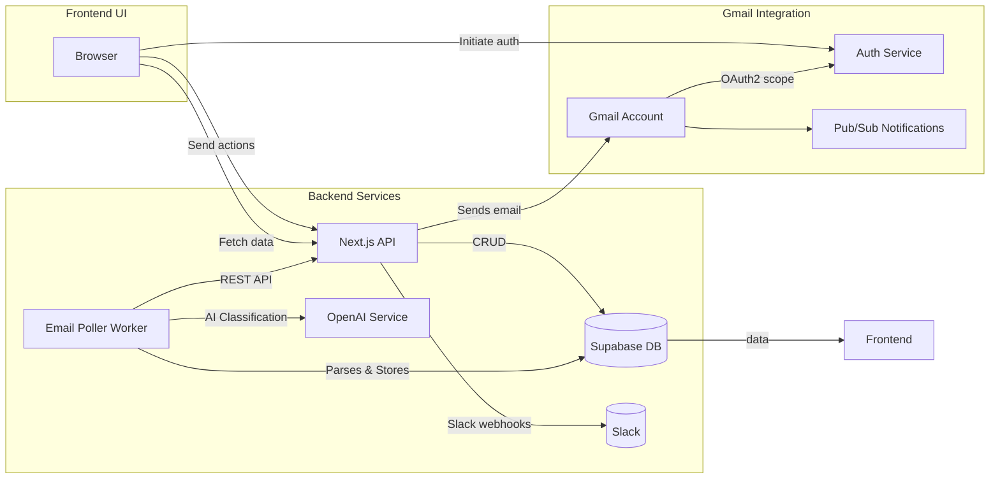
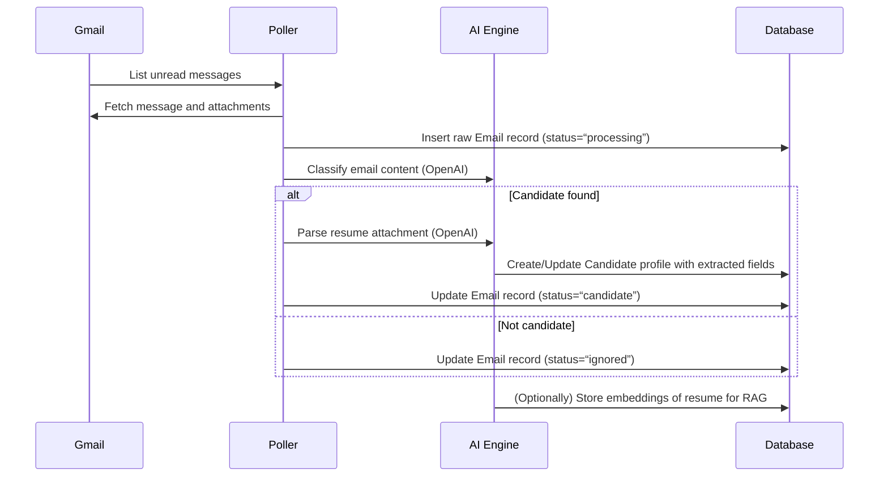

# Revision History

| Version | Date       | Author        | Description                  |
|:-------:|------------|---------------|------------------------------|
| 0.1     | 2026-07-03 | Your Name     | Draft baseline architecture  |

# Executive Summary

This **Foundation** document defines the core architecture and requirements for the AI-driven recruiting SaaS. It covers the initial feature set and integrations the agent must implement, including Gmail integration (OAuth, polling, attachments), resume parsing (with OCR fallback), OpenAI integration (structured outputs, RAG), data validation (Zod schemas), and core database/entities. It also specifies essential non-functional needs (security, observability, error handling, idempotency) and acceptance criteria. The agent will use this specification as an authoritative guide.  

Key points include: using OAuth2 libraries for Gmail with refresh tokens, running a background email poller (or Pub/Sub “watch”), parsing attachments with a fallback to OCR when needed, leveraging OpenAI’s **JSON Schema** support to guarantee structured outputs, storing candidate data in a **multi-tenant** database with RLS, applying strong **PII security** (encryption, RBAC), and using **structured logging** for observability. The acceptance checklist at the end ensures each requirement is testable.

# Project Vision

We are building an AI-assisted applicant tracking system (ATS) that **automatically ingests incoming candidate emails and resumes**, extracts structured profiles, and augments recruiters’ decisions with intelligence. The system’s unique value is its *explainable AI candidate intelligence*: it not only scores candidates but provides evidence-backed insights (strengths, weaknesses, recommended questions). In **Phase 1 (Foundation)**, the focus is on **data ingestion and profile creation**. The goal is that when a candidate emails their resume to the connected inbox, the system automatically creates a candidate record with parsed fields, without any human intervention.

Key vision points:
- **Automation of Intake**: Seamlessly pull new emails from Gmail, detect candidates vs irrelevant, download attachments.
- **Reliable Parsing**: Extract key resume fields (name, contact, experience, skills, education, etc.) and store them in a structured profile (modeled after a JSON Resume schema).
- **AI Structuring**: Use OpenAI models to parse free-text into these structured fields and to classify emails.
- **Data Integrity & Security**: Maintain data accuracy (via validation) and protect PII using encryption, RLS, and least-privilege access.
- **Human-in-the-loop baseline**: At this stage, all candidate actions (e.g. moving pipeline stages) remain manual. This phase lays the groundwork for future AI recommendations.
- **Extensibility**: The architecture should easily extend in later phases (e.g. Candidate Intelligence Engine, Copilot chat, approval flows).

# Scope of Foundation Phase

**In Scope (Phase 1)**:  
- **Gmail integration**: OAuth2 login, token management, polling for new messages or watch/notifications.  
- **Email processing worker**: Background job to fetch unread candidate emails.  
- **Attachment handling**: Download resume attachments (PDF, DOCX, images). Parse text; if text extraction fails, do OCR (Tesseract).  
- **Resume parsing**: Initial version can rely on OpenAI (or a parser library) to extract structured data (name, contact, experiences, etc.). Later phases will refine this.  
- **Database schema**: Supabase/Postgres tables for organizations, users, emails, candidates, resumes, pipeline stages, jobs. Must be multi-tenant (org scoping) and RLS-protected.  
- **Next.js API and Frontend**: Implement API endpoints to support auth, email sync, candidate CRUD, and render basic dashboard views (Inbox, Candidates).  
- **Validation & Schema**: Define Zod schemas for all data inputs/outputs and enforce them. Reuse schemas to avoid redundant parsing.  
- **Error handling**: Retry strategy for transient failures (email fetch, AI calls) with exponential backoff; ensure idempotency (use idempotency keys for dangerous ops).  
- **Logging & Monitoring**: Instrument structured logging (JSON format) for all services; collect metrics (emails processed, AI successes/failures).  
- **Security & PII**: Encrypt sensitive data at rest; do not log raw PII; use RBAC policies.  
- **Documentation**: Capture architecture diagrams (see below), data models, and tables of fields.  
- **Acceptance**: Verify data flows from Gmail→database without errors; basic UI shows the new data; no auth or validation defects.

**Out of Scope (Phase 1)**:  
- AI Candidate Insights (strengths, summaries) beyond structuring data.  
- Chatbot copilot.  
- Automated action execution (emails or calendar invites).  
- Full pipeline management.  
- Billing or multi-org onboarding UX.  
- Any new ML model training or bias mitigation (only using OpenAI API).

# Non-Negotiable Engineering Rules

1. **Agent must not hallucinate**: Every data extraction or summary must be traceable to source content (resume, email).
2. **Use JSON schema and validation**: All API inputs/outputs and AI outputs must strictly match predefined schemas (e.g. Zod schemas). Use OpenAI’s JSON schema enforcement.
3. **Reuse existing functionality**: Do not rewrite working code. The agent must audit `app/`, `lib/`, `workers/` to leverage or integrate with existing modules.
4. **Maintain multi-tenancy**: Include `organization_id` on every user-visible table. All queries must be scoped by tenant (via RLS policies).
5. **Structured logging**: Log in JSON format with consistent keys (`timestamp`, `level`, `service`, `requestId`, etc.). Include tracing IDs on requests.
6. **Error handling rules**: Only retry idempotent operations by default (GET/PUT/DELETE). For non-idempotent tasks (e.g. sending an email later), require explicit user approval or idempotency tokens.
7. **Do NOT cut corners**: No TODOs or stubs – every feature implemented must be functional and tested. The agent should not generate pseudo-code or incomplete handlers.
8. **Security first**: Secret keys (OpenAI key, Gmail client secret) go in environment variables only; never log them or commit to code.
9. **Testing**: Write unit/integration tests for every API and workflow. The implementation is incomplete without passing tests.
10. **Documentation**: Every new module/function must have descriptive comments. Public API endpoints must have clear request/response specs (see API Contracts below).

# Current Codebase Audit Instructions

Before implementing anything, the agent **must** inspect the existing code under `app/`, `lib/`, and `workers/`:

- **UI (app/dashboard/)**: Review pages under `app/dashboard/inbox`, `candidates`, `pipeline`, etc. Identify which views already exist. Avoid rewriting these; focus on filling missing data rather than new UIs.
- **API routes (app/api/)**: Note what endpoints exist (`/api/auth`, `/api/gmail`, `/api/emails`, `/api/resumes`, `/api/candidates`, `/api/jobs`, `/api/approvals`, `/api/slack`). Check their handlers and ensure authentication and validation is present.
- **AI modules (lib/ai/)**: Identify current prompt templates (e.g. for email classification, resume extraction). Reuse or update them; do not scrap working prompts. Ensure each prompt’s expected JSON schema is documented.
- **Gmail service (lib/gmail/)**: Examine `auth.ts` and `poller.ts`. If an OAuth flow is implemented, understand how refresh tokens are stored. If missing, this must be implemented.
- **Slack service (lib/slack/)**: There may be a `notify.ts` – ensure it's only triggered after approved actions. The agent should not break existing Slack integration unless fixing issues.
- **Worker scripts (workers/inbox-poller.ts)**: The background poller’s logic needs review. Confirm how often it runs and how it processes messages. The agent should add retries/error-handling here.

The audit must produce a table listing:
- **Component** | **Exists?** | **Status** | **Notes/Need**. 

No actual code is to be modified in this spec. The agent should only add or adjust where functionality is missing or buggy. For example, if the Gmail poller exists but does not handle attachments, the agent will augment it.

# Target Architecture (High-Level)

The system is a web application with these core components:



1. **OAuth2 Service**: Manages Google OAuth flows (redirects to Google, handles callback, exchanges code for tokens). Stores refresh tokens in encrypted secrets store.
2. **Email Poller Worker**: Runs periodically (e.g. cron or on schedule) to call Gmail API `users.messages.list` for unread. For each message:
   - Fetch full message and attachments (`messages.get`) via Gmail API.
   - Save raw email (sender, date, subject, body, threadId) in DB.
   - Pass content to an AI classifier (OpenAI) to determine if it’s a candidate email and to extract attachments as resume if needed.
   - If classified as a candidate, initiate resume parsing (described below).
3. **Database (Supabase)**: Stores all data:
   - **Organization, User**: multi-tenant support.  
   - **Email**: raw Gmail messages.  
   - **Candidate**: structured profile (parsed resume, contact info, etc.).  
   - **Attachment/Resume**: raw files or extracted text.  
   - **Jobs**: job requisitions.  
   - **Approvals, Actions**: pending actions for human approval.
   - All tables have a `tenant_id` or `org_id` column; enforce Row-Level Security so that each tenant only sees its data.
4. **AI Services**:
   - **OpenAI Models**: invoked for email classification, resume data extraction, etc. Use the **OpenAI API** with structured output (see below). No models are hosted locally.
   - **Embeddings/Vectors**: Candidate resumes and relevant documents are embedded (via `text-embedding-3-*` models) into a vector store (e.g. Supabase vector extension or an external vector DB) to support future search/RAG.
5. **API Layer**: Next.js backend routes authenticate requests (via Supabase Auth JWT), validate inputs, and perform CRUD. Key endpoints include candidate creation from parsed data, marking emails processed, and fetching dashboard metrics.
6. **Frontend (Next.js App)**: Renders the Dashboard UI (Inbox, Candidates list, etc.) by calling the API. Handles OAuth redirect for Google sign-in.

Below is a **mermaid sequence diagram** for the email/resume ingestion flow:



# Gmail OAuth & Token Strategy

- **OAuth2 Flow**: Use Google’s OAuth 2.0 for Web Server Applications. The agent must configure a Google Cloud OAuth Client ID (type “Web application”) with the appropriate redirect URI. Scopes should include:
  - `https://www.googleapis.com/auth/gmail.readonly` (read emails).  
  - (Optional) `https://www.googleapis.com/auth/gmail.send` if we later send emails.  
  - `openid email profile` to identify the user.  
- **OAuth Libraries**: Per Google’s guidance, use a well-maintained OAuth library (e.g. `google-auth-library`) instead of hand-rolled HTTP calls. This handles token exchange securely.
- **Incremental Consent**: Request only needed scopes; e.g. delay Gmail scopes until the user actually connects their mailbox (best practice).
- **Refresh Tokens**: Upon first authorization, Google issues a refresh token (long-lived). Store this token encrypted in the database. Use it to fetch a new access token whenever it expires. *Important*: Refresh tokens do not expire unless revoked. Handle “invalid grant” errors (revoked/expired token) by prompting re-auth.  
- **Token Storage**: Store refresh tokens in a secure table (e.g. `gmail_tokens`) with fields `(user_id, refresh_token)`. Access tokens need not be stored long-term (just use in memory and refresh as needed).
- **Gmail Push (Watch)**: While basic implementation uses polling, note that Gmail supports Pub/Sub push notifications (Gmail “watch” on inbox). In future, the agent can integrate Google Cloud Pub/Sub to receive near-instant email events, avoiding constant polling.

# Email Polling Worker

- **Schedule**: The `workers/inbox-poller.ts` script should run on a schedule (e.g. every 5–15 minutes via cron or a serverless job). It calls the Gmail API `users.messages.list` with `q=is:unread` (or checks the INBOX label).
- **Rate Limits**: Gmail API quotas exist. If close to limits, back off or slow polling. Respect `Retry-After` headers for 429/503 responses.
- **Processing Loop**: For each unread message:
  1. Fetch full message via `messages.get` (with `format=full` to get body and headers) and attachments via `messages.attachments.get`.
  2. Save raw email (sender, subject, snippet, threadId) to DB with status “processing”.
  3. Run email through AI classifier (prompt) to decide if it’s a candidate email. (E.g. look at sender domain, content keywords.)
  4. Update status: “candidate” or “ignored”. Non-candidate emails may be labelled or archived if desired.
- **Failure Modes**: If Gmail API calls fail (network error, quota, invalid token):
  - **Retries**: Implement exponential backoff for transient errors. Use at most 3 retries before aborting this cycle.
  - **Failures**: If a particular email consistently fails, log error, mark it for manual review, and move on.
  - **Idempotency**: Each email has a unique Gmail `messageId`. The poller should mark messages as read (or add a label) immediately after processing to avoid duplicates. If the worker restarts, it should skip already-processed messages.
  - **Alerting**: On repeated failures (>5 consecutive runs fail), trigger an alert (e.g. email to admin or a Slack notification).

# Attachment & Resume Parsing Pipeline

- **Supported Formats**: PDF, DOCX, TXT, and common image files (PNG/JPG if resumes are scanned).
- **Initial Text Extraction**:
  1. Use a library (e.g. `pdf-parse` or `pdfjs`) to extract text from PDFs.
  2. For DOCX, use `mammoth` or `docx` parser to extract text.
- **Quality Check**: After extraction, do a quick sanity check: count number of characters/words, check if key fields (like an “@” for email or capitalized name) are present.
- **OCR Fallback**: If native extraction yields very low content (e.g. <800 chars, no email/phone found), assume it might be an image-based PDF. Invoke OCR:
  - Convert PDF pages to images (300 DPI recommended).
  - Use **Tesseract OCR** (via an npm wrapper) to extract text.
  - Limit to first 5 pages and 15 seconds per page to avoid extreme delays.
  - Do **not** send images to external OCR APIs (for privacy).
  - Log OCR confidence; if still unreliable, mark candidate as “Needs manual review”.
- **Data Extraction**: Once text is available (from PDF or OCR), run it through the existing OpenAI resume parsing prompt. This prompt should output a structured JSON with fields like:
  - `name`, `email`, `phone`, `linkedin_url`, `experience: [ {company, title, startDate, endDate, summary} ]`, `education`, `skills`, etc. (modeled after JSON Resume).
- **Validation**: Validate the AI’s JSON against a Zod schema before writing to the DB. If validation fails, log the error and mark record for human review rather than auto-save bad data.
- **Fallback**: If AI parsing fails entirely (error or refusal), attempt a simpler regex-based parse (e.g. extract email with regex, split lines by dates for jobs) to salvage critical fields like name/email. However, such fallback should be marked “auto-extraction with low confidence” to alert recruiters to verify.
- **Storage**: Save the original resume file (or its text) in storage. In the DB, save a `resume_text` field and a `parsing_method` tag (e.g. “pdf_extract” vs “ocr”). Optionally, index the resume text in a vector store for search.

# OpenAI Integration Strategy

- **Models**: Use the latest GPT models available (e.g. GPT-5.x for high-quality parsing). For chat or simple classification, consider faster variants (GPT-5.4-mini/turbo for cost). Use the **Response API** with JSON schema support for structured output.
- **Structured Prompts**: For each AI task (email classification, resume parsing, scoring), design a prompt with:
  - System instructions (e.g. “You are a recruiting assistant…”).
  - Clear user input (the email body or resume text).
  - A **JSON Schema** to constrain output. Example: 
    ```json
    {
      "type": "object",
      "properties": {
        "candidate": { "type": "boolean" },
        "reason": { "type": "string" }
      },
      "required": ["candidate","reason"]
    }
    ```
  - Use `strict: true` to forbid extra fields.
- **Handling Incomplete/Bad Responses**:
  - Check if OpenAI’s `status` is “incomplete” (e.g. due to token limit) or “refusal”. On incomplete: retry with larger max_tokens or break input into smaller parts. On refusal: fall back to simple regex or mark manually.
  - Parse the JSON using Zod/schema to ensure it meets expected format. If parsing fails, log the raw output and error for debugging.
- **Retrieval-Augmented Generation (RAG)**:
  - Future phases will use RAG for context. Even in Phase 1, design data storage to support it: store candidate resumes and emails in a vector store. All **original text** must be kept, as embeddings alone are not enough for final answers.
  - Plan: upon candidate creation, generate an embedding of key text (resume summary, highlighted skills) and insert into Supabase vector table with a link to the candidate. This enables semantic search later.
- **Prompt Templates**:
  - Maintain reusable prompt templates (in `lib/ai/prompts.ts` or similar) for each task. Include examples in code comments for clarity.
  - Example tasks: “Is this a candidate email or spam?”, “Extract structured candidate info from this resume”, “What is this person’s top skill?” (for testing).
- **Rate Limits and Batch**: Batch OpenAI calls where sensible (e.g. if processing 100 emails, consider splitting into chunks). Monitor and log token usage for cost tracking.

# Data Validation and Schemas

- **Zod for Type Safety**: Define Zod schemas for all incoming data and AI outputs. For example, a `CandidateProfileSchema` covering all JSON Resume fields. Also have schemas for each API request/response.
- **Single Source of Truth**: Write each schema only once (module-level) and reuse. Do not redefine the same schema in multiple places.
- **Validation Layers**:
  1. **API Boundary**: Validate every HTTP request body/query against Zod. Reject and 400 on failure (before business logic).
  2. **AI Output**: Immediately validate OpenAI JSON output. If any field is missing or wrong type, do not trust it.
- **.parse vs .safeParse**: In synchronous endpoints, `.parse()` (which throws on invalid) is fine; for bulk operations, `.safeParse()` can avoid exceptions.
- **Strictness**: Use `.strict()` on schemas so unexpected fields are disallowed, preventing malicious or stale data.
- **Schema Evolution**: Keep schemas in version control. If adding new fields later, use `.passthrough()` when reading older entries or handle migrations carefully.
- **Testing**: Write unit tests that feed invalid data to each schema to ensure they reject as expected.

# Database Requirements

Design a PostgreSQL (via Supabase) schema with these core tables:

| **Entity**    | **Key Fields / Columns**                                           |
|---------------|--------------------------------------------------------------------|
| Organization  | `id, name, domain, created_at`                                     |
| User          | `id, org_id, email, role (admin/user), created_at` (via Supabase)  |
| Email         | `id, org_id, gmail_message_id, thread_id, from, subject, date, raw_body, status` |
| Attachment    | `id, email_id, filename, content_type, size, text_extracted, parsing_method` |
| Candidate     | `id, org_id, name, email, phone, linkedin, skills[], summary, work_experience[], education[], resume_text, overall_score` |
| Job           | `id, org_id, title, description, requirements, created_by`         |
| PipelineStage | `id, org_id, name, order, is_terminal`                              |
| CandidateStage | `id, candidate_id, pipeline_stage_id, assigned_to, entered_at`      |
| Approval      | `id, org_id, candidate_id, action (text, email, calendar), status (pending/approved/rejected), requested_by, requested_at, resolved_at` |
| Settings      | Tenant-wide config (e.g. scoring thresholds)                       |

**Notes**:  
- All tables have `org_id` (tenant) and appropriate foreign keys. Enable **Row-Level Security** so policies restrict rows by `org_id = auth.org_id()`.  
- Store **only necessary PII**: full name, contact email/phone. Do NOT store sensitive PII like SSNs or financials.  
- Personal data (emails, phones) should be encrypted-at-rest (e.g. Postgres `pgcrypto` or Supabase Vault).  
- The `Candidate.work_experience` and `education` can be JSONB arrays matching JSON Resume structures.  
- Index: Add indexes on frequently queried fields (e.g. `email.org_id`, `candidate.email`, vector embedding columns, etc.).  
- Use Supabase Auth to handle user login; it provides a `user_id` to link with DB records. Set up a Postgres `users` table if custom fields needed.

# API Contract (Example Endpoints)

Below is a non-exhaustive list of key REST endpoints and their purposes. All endpoints require an Authorization header (Bearer JWT from Supabase). Errors return JSON `{error: "message"}` with appropriate HTTP status codes.

| **Endpoint**         | **Method** | **Request Body / Query**               | **Response**                       | **Description**                                  |
|----------------------|------------|----------------------------------------|------------------------------------|--------------------------------------------------|
| `/api/auth/login`    | GET        | (redirect)                             | (redirect to Google OAuth)         | Initiate Google OAuth sign-in.                   |
| `/api/auth/callback` | GET        | `code`, `state` (query params)         | 200 OK / redirect                  | Exchange code for tokens, save refresh token.    |
| `/api/gmail/sync`    | POST       | `{}`                                   | 202 Accepted                       | (Admin) Trigger manual email poll.               |
| `/api/emails`        | GET        | `{status, page}`                       | `{emails: [...], total: N}`        | List processed emails (with filters).            |
| `/api/emails/:id`    | GET        | —                                      | `{email}`                          | Get details of one email record.                 |
| `/api/candidates`    | GET        | `{status, job_id, page}`               | `{candidates: [...], total: N}`    | List candidates, filter by job or pipeline.      |
| `/api/candidates`    | POST       | `CandidateProfileSchema` (JSON)        | `{id: ..., ...}`                   | Create new candidate (from manual upload).       |
| `/api/candidates/:id`| GET        | —                                      | `{candidate}`                      | Full candidate profile (with intelligence once done). |
| `/api/jobs`          | GET        | `{page}`                               | `{jobs: [...], total: N}`          | List job requisitions.                           |
| `/api/jobs/:id`      | GET        | —                                      | `{job}`                            | Get one job detail.                              |
| `/api/approvals`     | GET        | `{status, page}`                       | `{approvals: [...], total: N}`     | List pending actions needing approval.           |
| `/api/approvals/:id` | POST       | `{approve: true/false}`                | `{status: "approved"}`             | Approve or reject an action.                     |
| `/api/slack/notify`  | POST       | `{candidate_id, message}` (webhook)     | 200 OK                             | Slack integration webhook for notifications.     |

*Authentication & Errors*: Use `401` for unauthenticated, `403` for forbidden (e.g. wrong org), `400` for validation errors, and `500` for unexpected failures. All endpoints must validate input with Zod and return detailed error messages on failure.

# Logging and Observability

- **Structured Logs**: Log all events in structured JSON (e.g. `{"time":..., "service":"poller","level":"info","event":"email_fetched", "emailId":123}`). New Relic emphasizes that structured logging is vital for monitoring and debugging. Include request/trace IDs to correlate logs.
- **Log Levels**: Use `error` for failures, `warn` for retryable issues, `info` for normal operations (email fetched, candidate created), and `debug` for verbose diagnostics.
- **Metrics & Monitoring**: Instrument counters (e.g. total emails processed, candidates created) and duration histograms for critical operations (AI call latency, DB write times). Push metrics to a monitoring system (Prometheus, or Supabase Stats).  
- **Health Checks**: Expose a simple `/healthz` endpoint that checks DB connectivity and API responsiveness. The poller should check this before operations or run in a container that uses it.
- **Alerts**: Configure alerts for: high error rates in poller, Auth failures (e.g. expired Google token), or unexpected downtime. 

# Error Handling and Retry Policy

- **Transient vs Permanent**:
  - **Transient** (e.g. network timeouts, 429 rate-limit, 5xx from APIs): Retry with exponential backoff and jitter (e.g., 1s, 2s, 4s, … up to a max). Limit retries to 3 before giving up. For email polling, a failed Gmail call should be retried later; don’t drop the email.
  - **Permanent** (e.g. validation error, 400 from API, 4xx from Gmail indicating no retry): Fail fast and log. Do not retry.
- **Idempotency**:
  - Only retry **idempotent operations** safely.  GET, PUT, DELETE are idempotent by nature. POST must be carefully handled. Example: if our API sends emails or calendar invites (in later phases), ensure each external operation includes an idempotency key.
  - For non-idempotent tasks (like creating a candidate in DB), ensure the code first checks if that candidate already exists (e.g. by unique email/ID) to avoid duplicates on retries.
- **Worker Reliability**:
  - The inbox poller should catch all exceptions so it doesn’t crash. On uncaught exceptions, it should log the error and exit cleanly (to be restarted by the scheduler).
  - For background jobs (if using a job queue), use a persistent queue (e.g. Supabase pgmq or Redis queue). Each job should have a retry count and move to dead-letter if exceeded.
- **User-Facing Errors**:
  - API endpoints should never expose stack traces. Always return a user-friendly error message and log full details on the server.
  - Validation errors should return HTTP 400 with a JSON of which field failed (from Zod error).

# Security and PII Handling

- **Authentication & Authorization**: Use Supabase Auth (JWT) to identify users. Verify `auth.user().id` on each request. Implement Role-Based Access Control (RBAC): e.g. only users with role “admin” in an org can access org-wide settings or view all candidates.
- **PII Encryption**: Encrypt sensitive fields in the database at rest (e.g. with Postgres `pgcrypto` or Supabase’s column encryption). Candidate emails and phone numbers should be treated as PII. Encrypt any refresh tokens or secrets in your DB.
- **Data Minimization**: Only store PII that we need (name, email, phone). Do not collect additional sensitive info (no SSNs, health data, etc). If new PII is introduced, update privacy policy and storage rules.
- **Secure Transport**: All data in transit must use HTTPS. The backend should enforce TLS (and use `secure` cookies or headers for tokens).
- **Throttling**: Protect APIs against brute force or floods. Use rate limiting (e.g. Supabase Edge functions can throttle by IP or user).
- **Third-party Secrets**: Keep OpenAI API key and Google client secrets in environment variables or secret manager. Do not log these or return them in any response.
- **Compliance**: If any candidate data falls under GDPR/CCPA, ensure consent at signup. Provide data export/deletion endpoints on request (future work).

# Testing and Acceptance Criteria

The feature set is only complete when the following can be demonstrated:

| **Acceptance Criteria**                                         | **Verification**                             |
|-----------------------------------------------------------------|----------------------------------------------|
| 1. Google OAuth login works and refresh token is stored          | Login, persist token, and use to call Gmail. |
| 2. Poller fetches new unread Gmail messages into DB             | Seed inbox; confirm DB new Email records.    |
| 3. Attachments (PDF/DOCX) download and parse (with OCR if needed)| Upload test resume; check `resume_text`.     |
| 4. AI extraction fills candidate profile fields correctly       | Given known resume, fields (name, skills) match. |
| 5. Zod validation rejects malformed data                        | Send bad request to API; expect 400 with error. |
| 6. Database multi-tenancy enforced (users see only own org data) | User A cannot fetch User B’s candidate.      |
| 7. Structured logging in place                                  | Inspect logs – JSON entries with metadata.   |
| 8. Retry logic on transient failures                            | Simulate Gmail 503; worker retries and succeeds. |
| 9. No TypeScript or ESLint errors (builds clean)                | `npm run build` passes with no errors.       |
| 10. Environment variables validated on startup                  | App should error if critical ENV (e.g. OAUTH_CREDENTIALS) is missing. |

These criteria form the **Definition of Done**. The agent prompt for implementation must require proof of these (for example, an automated test suite demonstrating them).

# Deliverables for Agent Prompt

When generating the implementation prompt (to give to the coding agent), include:
- References to this Foundation doc and Architecture diagrams so the agent follows the design.
- Explicit lists of files/folders to create or update, e.g.:

  ```
  /app/api/auth/[...].ts
  /app/api/gmail/[...].ts
  /lib/gmail/auth.ts
  /lib/gmail/poller.ts
  /lib/ai/prompts.ts
  /workers/inbox-poller.ts
  /lib/slack/notify.ts
  ```
- Mark any **“Do Not Modify”** items: e.g. existing dashboard UI files, stable model prompt templates, seed data scripts.
- Clear rules (from Non-Negotiable) reiterated.

Overall, this document serves as the **source-of-truth specification** for Phase 1. The coding agent must implement *exactly* what is described above (and nothing more) before moving to the next phase.

