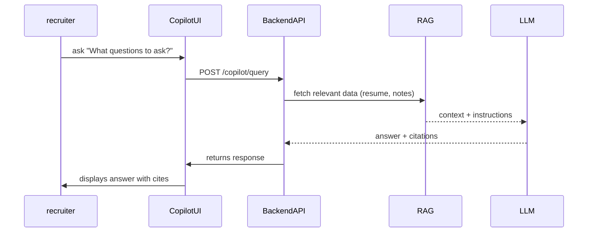

# Executive Summary

The **Recruiter Copilot** is an AI-powered assistant embedded within the hiring platform to **augment recruiters, sourcers, and hiring managers** across every phase of the hiring process. Its primary value is **context-aware decision support**: it understands the full candidate profile (resume, emails, notes, job requisitions, feedback, etc.) and provides evidence-backed answers, summaries, and suggested actions. By automating and accelerating routine tasks (e.g. interview prep, candidate outreach, follow-ups), the Copilot dramatically **reduces time-to-hire and error** while improving consistency and quality of decisions. Importantly, it maintains recruiter authority: all outputs are **grounded in candidate data**, cite sources, and are **approvable by a human**. 

In practice, the Recruiter Copilot enables features like **Q&A about candidates**, **automated email drafting**, **interview question generation**, and **candidate comparisons**, all using the candidate’s own context. It works as an “AI teammate” that **knows your candidates** in depth. The Copilot never hallucinates facts or infers protected characteristics; it always indicates uncertainty and defers to the recruiter. Its use of Retrieval-Augmented Generation (RAG) ensures each answer or suggestion is backed by fresh data from the candidate’s intelligence record.  

In short, the Copilot turns the platform’s **Candidate Intelligence Engine** into an interactive assistant: it turns passive data into active guidance. Recruiters save time (by ~30% or more on routine tasks), make more consistent evaluations, and feel empowered with data-driven confidence. The Copilot differentiates our product by combining **deep candidate profiling** with **AI conversation** – no other ATS seamlessly integrates QA, synthesis, and action planning from existing data. This document (Phase 3: **Recruiter Copilot**) defines the end-to-end vision, user journeys, system capabilities, prompts and safety rules, APIs, and success criteria for this feature. 

# 1. Purpose & Vision

The Recruiter Copilot’s **purpose** is to serve as an **intelligent assistant** to talent acquisition professionals. It ensures **decisions are grounded in data** and that routine workflows become faster, more consistent, and more insightful. The Copilot’s vision is to allow recruiters, sourcers, and hiring managers to *“interview, assess, and engage candidates with AI-powered clarity”*. 

**Target users** include:
- **Recruiters:** responsible for screening candidates, scheduling interviews, communicating with candidates, and shepherding them through the pipeline. They want quick insights and time-saving drafts.
- **Sourcers:** focus on candidate pipeline and outreach. They need help personalizing messages and triaging who to engage.
- **Hiring Managers:** own final hiring decisions and interview plans. They need high-level candidate summaries and key concerns highlighted.

**Primary value propositions:** 
- **Time Savings:** Automate repetitive tasks (finding context, summarizing, drafting) so recruiters spend more time engaging.
- **Consistency & Quality:** Provide standardized interview prep briefs, structured follow-ups, and unbiased candidate comparisons across the team.
- **Better Decisions:** Surface hidden strengths/weaknesses and evidence (via the Candidate Intelligence Engine) so assessments are fact-based.
- **Enhanced Communication:** Generate professional email/rejection templates tailored to candidate context, reducing friction.
- **Competitive Differentiation:** Unlike generic AI chatbots, our Copilot leverages an integrated **Candidate Intelligence Card** for **complete context**, meaning it never “forgets” past notes or relies on general knowledge. This in-house, context-rich approach is unmatched by other HR tools, which often have no memory or hallucinate information.

# 2. User Personas & Journeys

We identify **four personas** and detail **three end-to-end journeys** for each. Journeys describe steps, Copilot inputs/outputs, and success criteria.

| Persona            | Role & Goals                                                                                                                                       |
|--------------------|----------------------------------------------------------------------------------------------------------------------------------------------------|
| **Senior Recruiter**   | Manages full-cycle recruitment. Needs to quickly screen candidates, prepare interviews, and coordinate with hiring managers.                    |
| **Technical Sourcer**  | Finds and engages passive candidates. Needs to write compelling outreach, evaluate initial fit, and keep track of communications.             |
| **Hiring Manager**     | Leads interviewing and decision-making. Needs concise candidate summaries, relevant questions to ask, and clarity on candidate fit/risks.   |
| **Talent Coordinator** | Administrative role supporting scheduling and communication. Needs to manage follow-up emails, interview scheduling drafts, and candidate logistics. |

## 2.1 Senior Recruiter Journeys

1. **Screening a New Candidate:** 
   - **Steps:** Recruiter reviews a newly parsed candidate profile. Asks Copilot “How does this candidate fit our [Job X]?”. 
   - **Inputs:** Candidate resume, extracted skills, and job description. 
   - **Copilot Output:** A brief *match summary* (strengths, weaknesses, job-fit score) with evidence (citations to resume or cover letter). Possibly an interview question or follow-up note suggestion.
   - **Success:** Recruiter quickly decides keep-or-dismiss based on clear recommendation and evidence. If in doubt, Copilot cites “missing skills” instead of guessing.

2. **Interview Preparation:** 
   - **Steps:** Before an interview, recruiter clicks “Prep with Copilot”. Copilot reviews notes and feedback from past stages. Recruiter asks: “What should I focus on?” or “List top 3 interview questions.” 
   - **Inputs:** Candidate intelligence (experience history, past feedback), job competencies.
   - **Copilot Output:** *Interview brief* highlighting areas not covered (e.g. weak skills), suggested behavioral/technical questions tied to candidate background, any red flags or repeated achievements to ask about.
   - **Success:** Recruiter conducts a focused interview, covering all key points and clarifying uncertainties.

3. **Candidate Outreach Email:** 
   - **Steps:** Recruiter selects a candidate to email. Copilot is given templates: “Send follow-up email” or “Progress update”. 
   - **Inputs:** Candidate name, last interaction (e.g. phone screen notes), role title, stage.
   - **Copilot Output:** A draft email tailored to the candidate’s context (“Thanks again for our call... next steps are X,”). Contains correct names/roles and next actions. 
   - **Success:** Candidate communication is timely, personalized, and double-checked by recruiter quickly.

## 2.2 Technical Sourcer Journeys

1. **Personalized Outreach:** 
   - **Steps:** Sourcer pulls candidates from LinkedIn. Copilot drafts a cold email: “Reach out to [Candidate Name] for [Role]”. 
   - **Inputs:** Candidate public profile (job titles, skills from LinkedIn/resume) and job description.
   - **Copilot Output:** Engaging outreach message, referencing candidate’s key skills/experience and the job’s unique appeal. Tone matches company brand.
   - **Success:** Higher response rate to outreach, minimal editing required by Sourcer.

2. **Candidate Evaluation:** 
   - **Steps:** Sourcer evaluates a shortlist. Asks Copilot: “Compare these 3 candidates.” 
   - **Inputs:** Three candidate profiles and job requirements.
   - **Copilot Output:** Comparative table of skills, experience, strengths/weaknesses for each candidate; recommendation on priority order.
   - **Success:** Sourcer quickly identifies top candidates and moves them through pipeline.

3. **Maintaining Pipeline:** 
   - **Steps:** Sourcer follows up with passive candidates. Copilot suggests follow-up content: “Check in with [Candidate]” 
   - **Inputs:** Previous email history, candidate profile.
   - **Copilot Output:** Gentle reminder draft email (“Just wanted to see if you’re still interested…”), schedule suggestions for further outreach. 
   - **Success:** Candidates remain engaged without recruiter writing new drafts each time.

## 2.3 Hiring Manager Journeys

1. **Reviewing Candidates:** 
   - **Steps:** Hiring manager joins platform. Asks Copilot: “Which candidates are ready for me to review?” 
   - **Inputs:** Pipeline stage data (scorecards from recruiter), candidate summaries.
   - **Copilot Output:** Ranked list of candidates by match score, with short justification (evidence-based). 
   - **Success:** Manager focuses on strongest candidates and trusts the ordering.

2. **Planning Interview Questions:** 
   - **Steps:** Manager, given candidate's resume and expected role responsibilities, asks Copilot: “What specific questions should I ask [Candidate]?” 
   - **Inputs:** Job responsibilities and candidate’s background (skills, projects).
   - **Copilot Output:** List of tailored questions (technical and cultural). Each question includes rationale from candidate’s profile (e.g. “asking about leadership: candidate led X project”).
   - **Success:** Interviews probe important areas not previously covered.

3. **Post-Interview Debrief:** 
   - **Steps:** After interviews, manager asks Copilot: “Summarize candidate’s interview performance.” 
   - **Inputs:** Interviewer notes (text feedback), candidate intelligence.
   - **Copilot Output:** Consolidated summary of all interviewer comments, highlighting consensus strengths/weaknesses, plus any mismatches.
   - **Success:** Manager and team make balanced hire/no-hire decisions quickly with full context.

## 2.4 Talent Coordinator Journeys

1. **Scheduling Interviews:** 
   - **Steps:** Coordinator needs to email candidate to schedule. Copilot drafts “Invite to interview” email with multiple time slots. 
   - **Inputs:** Candidate contact info, recruiter availability, role and location.
   - **Copilot Output:** Polite scheduling email with proposed times (“...We have slots on Wed at 3pm or Thu at 10am...”). 
   - **Success:** Candidate confirms an interview time with minimal back-and-forth.

2. **Follow-up Notifications:** 
   - **Steps:** After interview is set, coordinator sends reminder to candidate. Copilot drafts “Interview Reminder” email. 
   - **Inputs:** Interview date/time, participant names.
   - **Copilot Output:** Friendly reminder email with logistical details (interviewer names, dial-in info, next steps).
   - **Success:** Candidate shows up ready and informed.

3. **Rejection Email Drafting:** 
   - **Steps:** Position is closed, need to send regrets. Copilot drafts rejection emails in bulk. 
   - **Inputs:** Candidate name, stage at which they were rejected, any feedback notes from recruiters.
   - **Copilot Output:** Compassionate yet professional rejection email. Optionally include personalized note if available (e.g. “Thank you for [specific experience]. Unfortunately…”). 
   - **Success:** Rejection messages are sent swiftly with appropriate tone, preserving employer brand.

# 3. Copilot Capabilities

The Copilot offers **several core capabilities**, each triggered by user intent or UI actions. For each, we define inputs, outputs, constraints, and possible failure modes.

1. **Context-Aware Q&A:** Allows the recruiter to ask natural language questions about the candidate (e.g. “What has been their career progression?” or “How experienced are they with Java?”).
   - **Inputs:** Question string, plus contextual grounding (candidate intelligence: resume text, notes, job description, etc.).
   - **Output:** Concise answer with supporting details (with citations to source fields or text). E.g. “They started as a Junior Developer (2015) and are now Senior Engineer. They mention Java on projects X and Y.”.
   - **Constraints:** Must use only candidate-specific data; cannot hallucinate. If data missing, answer with uncertainty (“No direct evidence”).
   - **Failure Modes:** LLM refuses or says “I don’t know” properly if insufficient data. Should never guess beyond inputs.

2. **Evidence-Backed Recommendations:** Provides suggestions like “Recommend interview/no-interview” or next action.
   - **Inputs:** Candidate scorecards, fit analysis from Candidate Intelligence Engine, recruiter prompts (“Recommend next step”).
   - **Output:** A decision plus reasoning (e.g. “Recommend moving forward: candidate’s skills match 85% of core requirements”). Possibly a confidence score.
   - **Constraints:** Ground recommendation in scores and data. Always include rationale and confidence. 
   - **Failure Modes:** If evidence is contradictory or weak, it should say “Needs more data” instead of confident yes/no.

3. **Action Planning:** Breaks down recruiter’s goals into tasks. Example: “Plan my next steps for candidate.”
   - **Inputs:** Candidate status, recruitment stage, organizational rules (e.g. number of interviews needed).
   - **Output:** Ordered action list (e.g. “(1) Schedule technical interview, (2) Prepare test assignment, (3) Send calendar invite”). Each with short justification.
   - **Constraints:** Must abide by defined pipeline stages and approvals. 
   - **Failure Modes:** If asked an unsupported plan (e.g. external to platform capabilities), suggest alternatives.

4. **Email Draft Generation:** Creates or suggests email content (outreach, follow-ups, rejections).
   - **Inputs:** Email type (template), candidate name, details (meeting times, etc.), recruiter notes.
   - **Output:** Fully-formed draft email with placeholders filled (“Dear Alice...”). Includes relevant context (role, location, previous interactions).
   - **Constraints:** Use professional tone. Avoid sensitive info in emails (like salary without permission). Ensure facts (names, dates) are correct.
   - **Failure Modes:** If insufficient info (e.g. meeting time unknown), ask for clarification (“What times are you available?”).

5. **Interview Question Generation:** Proposes role- and candidate-specific questions.
   - **Inputs:** Candidate’s background (experience, skills) and job competencies.
   - **Output:** List of targeted questions (e.g. “Tell me about your experience with cloud deployments”, “Describe how you handled X project”).
   - **Constraints:** Questions should cover unverified skills or weaknesses (per Candidate Intelligence). They should be relevant to the role’s responsibilities.
   - **Failure Modes:** Should avoid overly generic or irrelevant questions; if asked about completely unknown domain, respond “Lacking info”.

6. **Candidate Comparison:** Compares multiple candidates side-by-side.
   - **Inputs:** Two or more candidate intelligence profiles and a job description.
   - **Output:** Tabular summary of skills, experience, fit scores, and one-line pros/cons for each candidate.
   - **Constraints:** Fair, evidence-based (e.g. “Bob has 5 yrs Java vs Alice 3 yrs – B’s code samples rated higher”).
   - **Failure Modes:** If candidates have no overlap, say comparisons not possible.

7. **Note Summarization:** Summarizes recruiter or interviewer notes.
   - **Inputs:** Freeform notes text or voice transcript.
   - **Output:** Structured bullet summary (key points, actions) and flags (e.g. “Recommend follow-up on portfolio sample”).
   - **Constraints:** Must not omit critical points. If notes unclear, indicate uncertainty.
   - **Failure Modes:** If notes are too fragmented, ask user to clarify or split.

8. **Follow-Up Scheduling:** Recommends next steps/timeframes.
   - **Inputs:** Current pipeline stage and timeline policies (e.g. “third week in pipeline”).
   - **Output:** Suggested next interaction (phone screen, interview, etc.) and timing (e.g. “Suggest 2-3 day gap after phone screen”).
   - **Constraints:** Abide by company’s SLA (e.g. no more than 48 hours idle).
   - **Failure Modes:** If schedule conflicts, ask for alternative options.

Each capability returns not just content, but also **metadata**: source citations (e.g. “” pointing to internal data fields or notes), confidence levels (e.g. “High/Medium/Low”), and a statement of any assumptions (like “assuming role requires Java expertise”).

# 4. Context & Grounding Sources

The Copilot **only uses the internal candidate context** and explicitly allowed sources. We prioritize **fresh, first-party data** and **disallow speculative external data**. Key sources include:

- **Candidate Intelligence Card:** All structured and unstructured candidate data produced by the platform (resume parse, interview feedback, recruiter notes, assessments, etc.). *Primary source*.  
- **Resume Text:** Full resume content (parsed fields and raw text).  
- **Email Thread:** All inbound/outbound emails with the candidate (raw content).  
- **Job Description:** The official job posting (title, requirements) for matching context.  
- **Pipeline History:** Timestamps and outcomes of each stage (screens, interviews).  
- **Recruiter/Interviewer Notes:** Free-text notes and scorecards from each touchpoint.  
- **Assessment Results:** Scores and feedback from any tests or coding assignments.  
- **Public Profiles (optional):** If explicitly allowed by user settings, e.g. LinkedIn or portfolio links provided by candidate. Only if consented and relevant. 

**Disallowed sources:** Social media scraping, general internet search, guessing based on public info (unless explicitly configured). Crucially, *no inference* of protected characteristics (race, religion, age) or sensitive data beyond what is in the profile. The Copilot explicitly warns if requested to use external sources. 

**Data Freshness & Latency:** The Copilot should use the latest synchronized data. We assume the Candidate Intelligence Engine updates whenever new info is ingested. TTL (time-to-live) of context: nearly real-time (refreshed on major events). Retrieval latency must be low enough for interactive chat (<1–2 seconds for local DB queries). We will maintain a vector store of profile chunks (resume sections, notes, etc.) updated per candidate. Cold start: if profile is large, initial retrieval may take slightly longer, but subsequent queries should hit cached embeddings.

# 5. Interaction Patterns & UX

The Copilot supports multiple **conversation modes** and UI features:

| Mode                         | Description                                                    | Memory Scope          | Example UI Affordance                   |
|------------------------------|----------------------------------------------------------------|-----------------------|-----------------------------------------|
| **One-Shot Q&A**             | Single question/answer interaction. No follow-up.              | None beyond prompt    | In-dashboard “Ask Copilot” textbox      |
| **Multi-Turn Scoped Chat**   | Ongoing conversation about one candidate. Maintains state.     | Candidate-scoped      | Chat window within candidate profile    |
| **Task-Oriented Workflow**   | Guided multi-step tasks (e.g. interview prep, email drafting). | Session-limited       | Step-by-step wizard (dialogs/forms)     |

- **One-Shot Q&A:** The recruiter types a question, Copilot answers once. No internal memory beyond that session. Useful for quick facts (“Did she mention Python?”, “What was her last job?”).
- **Multi-Turn Chat:** A short back-and-forth conversation focusing on one candidate. The system remembers earlier turns within this chat. Ideal for exploring a topic (e.g. “Tell me about strengths”, follow-up “And weaknesses?”). Memory is **candidate-scoped** (persists as long as the candidate record is open). If recruiter closes and reopens candidate, prior chat can optionally reappear.
- **Task Workflow:** Structured interactions with forms and prompts. For example, scheduling, drafting email, or prepping interviews. User fills some fields (dates, recipients) and Copilot assists. This is **stateless beyond the form** (each workflow is self-contained, though it reads candidate context).

**Turn-taking rules:** The user (recruiter) leads the conversation. Copilot responds with short, focused answers (2–4 sentences or bullet points). Copilot avoids interrupting; if a long response is needed, it returns bulleted or numbered lists.

**UI affordances:** 
- **Evidence Highlights:** When Copilot cites information (e.g. from resume), hovering or clicking highlights the source text in the profile or note. 
- **Source Citations:** Answers include small footnotes or icons linking to sources (e.g. snippet from resume or note) and popover with context.
- **Confidence Badges:** Each answer or recommendation shows confidence (High/Medium/Low) based on evidence strength.
- **Editable Drafts:** Drafted emails or questions appear in an editor where recruiter can tweak before sending.
- **Saved Prompts/Templates:** Recruiter can store common queries or email templates (e.g. “technical interview invite”).

Below is a **summary table** comparing modes:

| Feature             | One-Shot Q&A                   | Multi-Turn Chat               | Task Workflow             |
|---------------------|--------------------------------|-------------------------------|---------------------------|
| **Initiation**      | Ad-hoc question box           | Open Chat in candidate page  | Click “Start [Task]”      |
| **Persistence**     | Ephemeral                       | Maintains short-term memory   | None or per-task temp     |
| **Memory Scope**    | Only current turn              | Candidate context + this chat | Just this session form    |
| **Use Case**        | Quick facts (“What languages?”)| Deep dive (“Tell me more...”) | Step process (scheduling) |
| **User Control**    | Free-form                       | Guided Q&A                   | Form-driven choices       |
| **UI Element**      | Input field + Go button        | Chat window UI               | Wizard/form pages        |

# 6. Prompting & Safety Rules

The Copilot’s prompting must **strictly enforce** rules to ensure accuracy and compliance:

- **Evidence-Only Responses:** The prompt instructs the LLM to answer *only based on candidate-specific data*. Example system prompt snippet: *“Use only the provided candidate profile and job info. Do not guess or make up information not in the data.”*
- **Require Citations:** Every factual statement or insight must cite its source (resume line, note text) inline. *“Cite supporting evidence from the candidate’s data.”*
- **Candidate Scope:** Explicitly tell the model it is talking only about one candidate. E.g. *“Focus solely on [Candidate Name]’s information.”*
- **Handle Missing Data:** If asked about something not present (e.g. “What is the candidate’s GitHub?” when none provided), the Copilot should respond with a clarifying question or admit ignorance: *“I don’t see any information about GitHub in this profile.”*
- **Protect Privacy:** Never reveal PII beyond what recruiter can already see (e.g. phone, email). Do not display hidden notes to non-authorized roles. 
- **No Hallucination:** A strict instruction: *“If uncertain, say ‘I don’t know’ or ‘No evidence found.’ Do not hallucinate answers.”* 
- **Disallowed Content:** The model must refuse requests outside scope. E.g. *“I’m sorry, I can’t predict future career moves”* or *“I cannot infer protected attributes like race or religion.”* 
- **Bias Mitigation:** Encourage neutral language. E.g. system prompt: *“Avoid stereotypes or assumptions. Provide balanced perspectives based on facts.”* 
- **Escalation Rules:** If user requests something ambiguous or risky (e.g. candidate references medical issues), Copilot should either safely decline or flag the conversation for a human reviewer. 

In short, **prompt engineering** imposes guardrails that confine the Copilot to factual, relevant, and safe territory. For instance, each capability’s prompt will begin with a fixed context (candidate intelligence card data and instructions) and end with a clear directive that answering must be grounded in that context. 

# 7. RAG & Retrieval Strategy

We employ **Retrieval-Augmented Generation (RAG)** to ground the Copilot’s answers in real data. 

- **Vector Store:** Candidate data (resume sections, notes, past Q&As) are broken into chunks (e.g. by paragraph or bullet) and embedded using a modern model (e.g. OpenAI Embedding or similar). These vectors are stored per candidate.
- **Chunking:** Long documents (resumes, emails) are split into logical sections (e.g. Education, Experience, Projects). We ensure chunks are not too large (<500 tokens) for accurate retrieval.
- **Embedding Model:** We recommend a recent specialized embedding model (e.g. OpenAI `text-embedding-3-small` or similar) to capture semantic similarity.
- **Retrieval:** On user query or capability invocation, we vectorize the query/instruction context and retrieve top-k relevant chunks (hybrid search: vector + keyword if needed). 
- **Similarity Threshold:** Only include chunks above a threshold (e.g. cosine similarity >0.80). If too few chunks, lower threshold or add generics like resume summary.
- **Citation Linking:** Each answer will explicitly link to the retrieved chunk (or original data source). E.g. answer: *“(from resume section: 2019-2021 at XYZ Corp)”*.
- **Fallback:** If no relevant chunk is found or all relevant chunks are poor matches (below threshold), Copilot responds that it has no evidence, rather than hallucinating. We may retry retrieval with broader parameters or ask user for more specifics.
- **Continuous Improvement:** We can track queries that fail retrieval and consider adding more context or fine-tuning embeddings. 

As best practice, we will evaluate and refine the RAG pipeline as recommended by experts (e.g., cleansing data, prompt tuning, evaluation metrics). We also plan to measure retrieval quality with metrics (precision/recall of chunk retrieval) and adjust strategies (like re-ranking) if needed. 

# 8. Conversation Memory & State Management

Memory ensures context continuity without leaking sensitive data.

- **What to Store:** 
  - *Candidate Context:* Updated job info, resume, notes (via Candidate Intelligence Engine). 
  - *Chat History:* Within a single session or short-term conversation.
  - *User Edits:* If recruiter edits a draft or adds a note, that becomes part of the candidate’s record (written back into the profile).
- **Memory Scope & Retention:** 
  - Candidate-specific facts remain indefinitely (or until candidate archive). 
  - Short-term conversation turns are kept for that session only.
  - Recruiter’s personal preferences (e.g. favorite templates) are user-specific.
- **Updating Memory:** 
  - When the recruiter confirms or edits Copilot output (e.g. corrects an email or rating), we log that action as part of audit trail (but not as AI training by default).
  - For example, if the recruiter edits a suggested question, the edit is saved in notes; if they approve a candidate, that decision is recorded.
- **Versioning:** 
  - Each Candidate Intelligence Card will be versioned (e.g. v1 after intake, v2 after screening, etc.) so we know which data was available when a Copilot interaction occurred. This helps audit and repro.
- **Audit Logging:** 
  - All Copilot queries and responses (with answers and sources) are logged (request, context, answer, timestamp). This log is immutable for compliance.
  - If a recruiter chooses to reuse a drafted email, that usage is also logged. Any modifications by the recruiter should be logged as changes to output.
  - Logs must be securely stored with access control (only authorized admins can review).

# 9. API & Integration Requirements (Conceptual)

The Copilot functionality will be exposed via well-defined API endpoints. Example conceptual contracts:

- **POST /copilot/query**: Send a natural language question about a candidate.
  - **Request:** `{ candidateId, userId, query: string }` (with auth token).
  - **Response:** `{ answer: string, citations: [ {source, snippet} ], confidence: number }`
  - **Errors:** 400 if query too long, 404 if candidate missing, 429 if rate-limited.

- **POST /copilot/action**: Request a high-level action plan (e.g. “plan next steps”).
  - **Request:** `{ candidateId, userId, actionType: string }`
  - **Response:** `{ plan: [string] }`
  - **Errors:** Similar structure.

- **POST /copilot/draft**: Generate a draft (email, questions, summary).
  - **Request:** `{ candidateId, userId, draftType: string, parameters: {...} }`
  - **Response:** `{ draft: string, placeholders: {...} }`
  - **Errors:** 400 for missing fields.

- **POST /copilot/compare**: Compare multiple candidates.
  - **Request:** `{ candidateIds: [id], jobId, userId }`
  - **Response:** `{ comparisonTable: string or structured data }`

**Authentication & Security:** 
- All endpoints require a valid user auth token (OAuth/OIDC) with scopes. 
- Rate limits: e.g. 5 queries/sec/user to prevent abuse. 
- Idempotency: e.g. repeated identical query returns same answer (unless data changed).
- Retries: Clients can retry on 5xx but should catch 429 and respect `Retry-After`.
- Errors: Clearly defined codes (400,404,500). On severe hallucination risk, Copilot returns 422 with message “Unable to generate safe answer.”

# 10. Evaluation & Metrics

We will measure both **quantitative** and **qualitative** performance:

- **Accuracy of Answers:** Percentage of Copilot answers with *correct and evidence-backed* content. We can measure via sampling: have humans rate whether answers cite correct profile info (target ≥95% precision). 
- **Citation Precision:** For all statements, measure if citations truly support the claim (goal ≥95%). Ensure the snippet backs the sentence.
- **Hallucination Rate:** % of answers with fabricated info. Target <2%. This is tracked via manual reviews and automated checks against the profile data.
- **Time Saved:** Measure time on tasks (screening, email drafting) with vs without Copilot. Target e.g. ≥30% time reduction in routine tasks.
- **User Satisfaction:** Survey recruiters on “helpfulness” and “trust in outputs.” Target high CSAT (≥4/5).
- **Effectiveness Metrics:** e.g. **Conversion Rate** of interviews to hires, or pipeline velocity. Improved efficiency should reflect in pipeline metrics (faster stage-to-stage moves).
- **Retrieval Quality:** Evaluate top-k retrieval precision/recall using a held-out set of queries (like typical recruiter questions).
- **System Performance:** API latency (aim <500ms on average for response generation after retrieval).
- **Security Checks:** Audits to ensure no data leaks, logs intact. Metrics on false refusals (overly cautious blocking vs needed answers).

Data for evaluation:
- We will create benchmark question-answer pairs using anonymized candidate records, and have HR experts validate outputs.
- Feedback loop: Recruiter flags in-app if an answer is wrong or incomplete.
- A/B tests: Periodically test improved LLM prompts against control to ensure improvements.

# 11. Acceptance Criteria & Success Gates

**MVP Criteria:**
- Copilot answers direct questions about a candidate using only the provided data (citing sources). **Precision ≥95%** on a test set.
- Copilot can generate interview questions and email drafts correctly (human review finds ≥90% acceptable).
- No hallucinations or privacy breaches in sampled outputs (hallucinations <2%).
- Interactive latency acceptable (<3s per answer).
- Recruiters report a noticeable speed-up (pilot study: ≥30% time saved on email drafting).

**Production-Readiness Criteria:**
- All core capabilities (Q&A, drafting, summarization, planning) implemented and verified.
- Robust RAG pipeline with automated tests for retrieval relevance.
- Security: OAuth implemented, logs encrypted, GDPR/PII compliance audited.
- Monitoring: Metrics for usage, latencies, error rates in place (e.g. Cloudwatch, Sentry).
- Scalability: Stress test handling 100 concurrent queries.
- Documentation: API docs completed, user help guides covering Copilot use cases.

If any criterion fails (e.g. hallucination >2%), we **refine prompts and retrieval** until met. Only when all gates pass do we declare the feature ready to deploy.

# 12. Out-of-Scope & Ethical Constraints

**Out of Scope:**
- **Final Hiring Decisions:** Copilot does *not* decide or auto-hire. It gives recommendations only.
- **Personality Inference:** No psychological or personality profiling from resume data.
- **Protected Characteristics:** Absolutely no inference of race, gender, age, religion. The Copilot must refuse any such attempt.
- **Medical or Legal Advice:** If candidate’s data mentions health issues, Copilot should not speculate.
- **Candidate-Side Bot:** This Copilot is internal to recruiters; it does not interact with candidates or replace candidate-facing chatbots.

**Ethical Constraints:**
- **Bias Mitigation:** Train and test the Copilot to avoid biased language. Ensure examples and prompts use neutral terminology.
- **Transparency:** The Copilot should be transparent about sources. Users should be aware content is AI-generated with cited data.
- **Consent & Privacy:** Only use candidate data that was consented to by the candidate (e.g. resume upload).
- **No External Scraping Without Consent:** Do not use LinkedIn or social data unless explicitly linked by recruiter.
- **Avoid Encouraging Harm:** If asked any question hinting harassment or illegal action, refuse with a safe completion.
- **PII Handling:** Sensitive personal data (SSN, etc.) should never appear in outputs. 

Any breach of these constraints should trigger an alert for review.

# 13. Implementation Roadmap

We propose a phased rollout:

- **MVP (Milestone 1):** 
  - **Features:** Basic Q&A (with RAG from candidate resume and notes), email draft templates (static fill-in).
  - **Deliverables:** 
    - `/copilot/query` API,  
    - “Ask Copilot” UI box, 
    - Email template generator for common scenarios.
  - **Validation:** Test Q&A answers for accuracy, ensure email drafts use correct template fields.

- **M1 (Milestone 2):** 
  - **Features:** 
    - Multi-turn chat, interview question generation, note summarization, candidate comparisons, action planning.
    - Improved RAG: include vector search with fine-tuned chunks.
    - Reply citation UI. 
  - **Deliverables:** 
    - `/copilot/compare`, `/copilot/draft`, multi-turn state machine. 
    - Copilot UI integrated in candidate page (chat sidebar or modal).
  - **Validation:** Recruiter pilot with real candidates; measure satisfaction, fix hallucination or context gaps.

- **M2 (Milestone 3):** 
  - **Features:** 
    - Templates for complex workflows (scheduling, follow-ups).
    - Integration with Slack/Gmail for sending approved drafts.
    - Analytics dashboard on Copilot usage/metrics.
  - **Deliverables:** 
    - API for action (scheduling), 
    - Scripts to push final drafts to email/slack after approval,
    - Monitoring and logging enhancements.
  - **Validation:** Full integration test (send email via Gmail API with Copilot content), measure adoption rates, iterate on UI.

Dependencies:
- Must have Candidate Intelligence Engine (Phase 1) complete to supply data.
- Requires secure OAuth login (foundation).
- RAG vector store set up (foundation infra).
- Completion criteria: each milestone is only considered done when acceptance gates (see section 11) are met.

# 14. Appendices

## A. Persona Journey Tables

**Senior Recruiter:** 
- *Journey 1:* “Screen candidate fit” (ask Copilot, decide keep/dismiss) ✓  
- *Journey 2:* “Interview prep” (generate questions/brief) ✓  
- *Journey 3:* “Follow-up email” (draft scheduling/follow-up email) ✓  

**Technical Sourcer:** 
- *Journey 1:* “Outbound outreach” (draft personalized email) ✓  
- *Journey 2:* “Triaging candidates” (compare candidates, recommend who to push) ✓  
- *Journey 3:* “Pipeline management” (schedule follow-ups, send nudge emails) ✓  

**Hiring Manager:** 
- *Journey 1:* “Review shortlist” (get ranked list with reasoning) ✓  
- *Journey 2:* “Plan interviews” (generate interview questions) ✓  
- *Journey 3:* “Evaluate outcomes” (summarize interview feedback) ✓  

**Talent Coordinator:** 
- *Journey 1:* “Schedule interview” (compose invite email) ✓  
- *Journey 2:* “Send reminders” (compose reminder emails) ✓  
- *Journey 3:* “Send regrets” (draft rejection messages) ✓  

(*Each ✓ indicates covered by Copilot capabilities.*)

## B. Interaction Modes Comparison

| Aspect                    | One-Shot Q&A         | Multi-Turn Chat           | Task Workflow          |
|---------------------------|----------------------|---------------------------|------------------------|
| **Initiation**            | Quick question input | Open chat session         | Guided form           |
| **Memory**                | None (stateless)     | Candidate-specific       | Session only         |
| **Use Case**              | Facts/checks         | Deep dive discussion     | Step-by-step tasks   |
| **Recruiter Input**       | Free-text question   | Free-text conversation   | Structured inputs    |
| **Copilot Output**        | Single answer        | Series of answers/dialog  | Task steps or draft  |

## C. API Contract Summary

| Endpoint       | Method | Request                                      | Response                               | Auth      |
|----------------|--------|----------------------------------------------|----------------------------------------|-----------|
| /copilot/query  | POST   | `{candidateId, userId, question}`            | `{answer, citations, confidence}`      | OAuth JWT |
| /copilot/draft  | POST   | `{candidateId, userId, type, params}`        | `{draftText, fields}`                  | OAuth JWT |
| /copilot/compare| POST   | `{candidateIds, userId, jobId}`              | `{comparisonMatrix}`                   | OAuth JWT |
| /copilot/action | POST   | `{candidateId, userId, actionType}`          | `{steps: [string]}`                    | OAuth JWT |

Authentication via OAuth 2.0 with role-based scopes (e.g. `copilot:read`, `copilot:write`). Rate limit per user ≈10 req/sec. Idempotent where applicable (repeated same request yields same response unless data changed).

## D. System Diagrams

```mermaid
flowchart TB
  subgraph Interview Prep
    A(Recruiter) -->|asks Copilot| CP[Copilot Chat Module]
    CP -->|retrieves| RAG[Retrieval (Candidate Data)]
    RAG --> CI[(Candidate Intelligence DB)]
    CP --> UI[UI (answers, highlights)]
  end
  CI -->|updates| CandidateDB[(Supabase Profile)]
  CP -->|API calls| Backend[(API Layer)]
```



These diagrams illustrate how the Copilot interacts with UI, the backend API, RAG datastore, and LLM to provide grounded answers and drafts.

