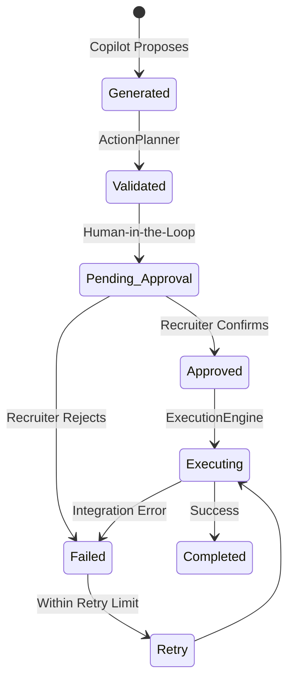

# Operational Architecture Report

## Core Philosophy
The platform has been successfully refactored into an **Action-Oriented Architecture**. The Recruiter Copilot now strictly operates as an analytical agent. It is completely decoupled from business execution. When the Copilot determines an action should occur, it emits a `proposed_operation`, which is delegated to the Action Planner.

## Components

### 1. The Action Object
The `Action` is the canonical operational unit across the platform. Every business operation proposed by the AI is represented as an Action record before execution.
It explicitly defines:
- **Identity:** Who is doing what to whom (Recruiter, Candidate, Job).
- **Metadata:** Action Category, Type, Risk, and Priority.
- **Context:** The AI reasoning and evidence backing the proposal.
- **Governance:** Current lifecycle status and approval policy.

### 2. Action Planner
The `ActionPlanner` is a dedicated abstraction that parses raw intents from the AI Copilot into structured `Action` objects. It determines the risk profile and statically assigns the `manual_recruiter` approval policy (future implementations can dynamically assign `auto_approved` based on the planner logic).

### 3. Human Approval Engine
The `ApprovalEngine` enforces a Human-in-the-Loop constraint. All actions default to `pending_approval`. No action can transition to `executing` without explicit cryptographic validation (via API routes mapped to an authenticated Recruiter).

### 4. Execution Engine & Integration Layer
The Execution Engine is a pure, AI-agnostic state machine. It orchestrates resolving external dependencies, handling retries, and recording final `Execution Reports`. All API calls flow strictly through the `IntegrationLayer`, standardizing timeouts and transient error recovery.

### 5. The Action Lifecycle
Every action strictly adheres to this state machine:

### 6. Execution Reports
Immutable `ExecutionReports` are generated for every terminal action (Completed/Failed), storing exact timestamps, latency (`duration_ms`), used external system IDs, and failure reasons to preserve full auditability for compliance.
